# Cold Lead Pipeline — Architecture Design

**Status:** Approved for implementation on `feat/cold-lead-pipeline`  
**Date:** 2026-07-22  
**Owner:** Fuzion Webz  
**Production policy:** No production deployment, no production migration, and no push from this workstream without a separate explicit decision.

## 1. Decision summary

Fuzion will add a weekly cold-prospecting pipeline to the existing Next.js admin application. The pipeline proposes one Israeli street, commercial centre, or compact business area; asks an admin to approve it through the existing notification system; discovers businesses through the supported Google Places API; audits their websites; assigns a deterministic quality score from 0 to 5; and publishes at most 50 scored prospects to a separate seller page.

Degaron does not research, approve, classify, or clean data. His workflow begins only after a complete weekly batch is published. He receives a ready call list ordered from the strongest opportunity to the weakest, records call outcomes, and promotes an interested prospect into the existing lead and agreement flows.

The architecture is hybrid:

- Agent 1 proposes the territory.
- Deterministic code validates, discovers, deduplicates, fetches, audits, scores, schedules, and publishes.
- Agent 2 performs only bounded visual/commercial judgement from a screenshot and precomputed audit evidence.
- Admins approve territory selection; sellers never participate in that decision.

## 2. Goals

- Produce one seller-ready list of up to 50 cold prospects every week.
- Keep cold outbound prospects structurally separate from warm Meta and website leads until a real conversation creates interest.
- Make every quality score explainable and reproducible.
- Reuse the current authentication, notification, push, seller, lead, agreement, commission, Prisma, Neon, and Vercel patterns.
- Prevent duplicate businesses, duplicate calls, and re-contact after a do-not-call request.
- Track cold-outbound performance independently from warm inbound performance.
- Make the entire feature removable by reverting or deleting a bounded set of models, routes, pages, and cron entries.

## 3. Non-goals

- No automated email, SMS, WhatsApp, robocall, or AI voice outreach.
- No scraping of `google.com/maps` HTML.
- No promise that Google returns every physical business in an area. The pipeline provides best-effort systematic coverage, not a legally or technically complete registry.
- No general-purpose CRM rewrite.
- No change to commission calculation or the existing payment flow.
- No automatic agreement creation. The seller uses the current agreement screen after qualification.
- No storage of reviews, ratings, or raw Google Maps content beyond what Google policy permits.

## 4. Website Quality Score

### 4.1 Status is separate from score

`WebsiteStatus` identifies what was actually found:

- `NO_WEBSITE`: Google returned no usable website.
- `SOCIAL_ONLY`: the website field resolves to Facebook, Instagram, TikTok, Linktree, WhatsApp, Waze, or another social/directory profile rather than an owned website.
- `PARKED`: the domain is parked, for sale, expired, or a registrar holding page.
- `UNREACHABLE`: three safe fetch attempts across a 24-hour window all failed.
- `ACTIVE`: an owned website was fetched and audited.
- `BLOCKED`: the site denied automated access or could not be audited safely.
- `UNKNOWN`: audit evidence is incomplete and the prospect must not be published yet.

Hard overrides:

- `NO_WEBSITE`, `SOCIAL_ONLY`, and `PARKED` receive score `0`.
- `UNREACHABLE` receives score `0` only after three failures separated across the retry window.
- `BLOCKED` and `UNKNOWN` are never silently scored. They retry, then move to admin review.

### 4.2 Active-site scoring

An active site receives a deterministic raw score from 0 to 100.

| Dimension | Weight | Evidence |
|---|---:|---|
| Availability and trust | 20 | HTTPS, redirect integrity, fatal HTTP errors, mixed-content indicators, broken first-party resources |
| Mobile speed | 20 | mobile Lighthouse lab score, LCP, CLS, TBT, viewport configuration, payload warnings |
| SEO readiness | 20 | indexability, title, description, canonical, one useful H1, heading structure, robots, sitemap, structured data, crawlable internal pages |
| Maintenance and content | 15 | broken links/images, placeholders, stale explicit dates, empty pages, inconsistent contact details, console-visible fatal markup problems |
| Visual UX | 15 | AI rubric over a mobile screenshot: hierarchy, readability, navigation, brand consistency, trust, CTA clarity |
| Commercial capability | 10 | service/contact conversion path; for retail/e-commerce: discoverability, product page, cart, checkout reachability, shipping/returns/payment trust |

The score conversion is fixed:

- `0`: raw score 0–19.
- `1`: raw score 20–39.
- `2`: raw score 40–54.
- `3`: raw score 55–69.
- `4`: raw score 70–84.
- `5`: raw score 85–100.

Seller inclusion rule:

- Scores `0` through `4` are eligible.
- Score `5` is excluded from the seller list but remains visible to admins in the cycle report.
- Ordering is ascending by quality score, then descending by audit confidence and commercial fit.

### 4.3 AI boundary

Agent 2 controls at most the 15 visual-UX points. It cannot independently turn a technically strong site into a score below 3. It receives:

- A mobile screenshot produced by PageSpeed/Lighthouse.
- The deterministic audit summary.
- A short, sanitized, untrusted excerpt of page text.
- The detected business shape: service, retail, or e-commerce.

It returns strict JSON validated by Zod:

```ts
type VisualAssessment = {
  visualScore: number; // integer 0..15
  confidence: number; // 0..1
  findings: Array<{
    code: "HIERARCHY" | "READABILITY" | "NAVIGATION" | "BRAND" | "TRUST" | "CTA";
    severity: "low" | "medium" | "high";
    evidence: string;
  }>;
  callAngles: [string, string, string];
};
```

The model has no tools, cannot navigate, and cannot follow instructions found in website content. Website text is explicitly marked as untrusted data. A malformed response is discarded and retried; it is never coerced into a score.

### 4.4 Audit versioning

Every result stores `scoringVersion`, initially `1`. A scoring-weight change increments the version. Existing scores remain auditable, and a re-audit creates a new immutable audit row rather than overwriting history.

## 5. End-to-end flow

```mermaid
flowchart RL
    A["Weekly cron creates cycle"] --> B["Agent 1 proposes territory"]
    B --> C["Admin notification"]
    C -->|Approve| D["Validate and queue discovery"]
    C -->|Reject| B
    D --> E["Google Places discovery"]
    E --> F["Dedupe by place ID and suppression list"]
    F --> G["Safe website fetch and PageSpeed audit"]
    G --> H["Agent 2 visual assessment"]
    H --> I["Deterministic 0–5 score"]
    I --> J["Publish up to 50 prospects"]
    J --> K["Seller cold-lead page"]
    K --> L["Call outcome and follow-up"]
    L -->|Interested| M["Promote to ContactSubmission"]
    M --> N["Existing seller lead/agreement/payment/commission flow"]
```



## 6. System components

### 6.1 Agent 1 — Territory Scout

Agent 1 runs once per weekly cycle. It is a single structured model call, not an autonomous browsing agent.

Inputs:

- Previous territory names and normalized coverage keys.
- Previous cycle counts and conversion performance.
- Existing Fuzion client cities and business categories, without private contact data.
- Allowed territory types: street, commercial centre, compact area.
- Country constraint: Israel.
- Target: enough business density to produce 50 eligible prospects.

Output:

```ts
type TerritoryProposalOutput = {
  displayName: string;
  city: string;
  kind: "STREET" | "COMMERCIAL_CENTER" | "AREA";
  searchQuery: string;
  rationale: string;
  expectedBusinessTypes: string[];
  confidence: number;
};
```

Deterministic validation rejects empty values, non-Israeli geography, previously approved coverage keys, and unsupported territory shapes. The proposal creates a persisted notification for every admin with `actionUrl=/admin/prospecting?proposal=<id>`. No paid Places discovery happens before approval.

### 6.2 Admin approval

The existing `Notification` model gains an `actionUrl` field and two notification types:

- `PROSPECTING_APPROVAL`
- `PROSPECTING_BATCH_READY`

The admin page shows the proposal, rationale, previous coverage, and approve/reject actions. Approval is atomic: only the first approval changes `PROPOSED` to `APPROVED`. Rejection requires a short reason and queues a replacement proposal for the same weekly cycle.

### 6.3 Google Places provider

The provider lives behind a narrow interface:

```ts
interface PlacesProspectingProvider {
  discover(input: TerritorySearchInput): Promise<DiscoveredPlace[]>;
  getLiveDetails(placeIds: string[]): Promise<Map<string, LivePlaceDetails>>;
}
```

Rules:

- Use Places API (New), never consumer Maps scraping.
- Use a separate GCP project, billing boundary, API key, and quota from the homepage review integration.
- Persist `placeId` indefinitely; Google explicitly exempts it from caching restrictions.
- Do not persist Google display name, address, phone, website URI, ratings, or reviews as durable prospect fields.
- Fetch name, phone, and address live when an admin or seller opens a list.
- During discovery, use website URI only transiently to launch the independent website audit. Persist the final audited domain and Fuzion-derived audit evidence, not the raw Places response.
- Do not request rating or reviews.
- `websiteUri` and `nationalPhoneNumber` are Enterprise-tier fields; the cost guard must assume that tier.

Coverage strategy:

- Text Search returns at most 60 results across pages for one query and is not guaranteed exhaustive.
- Build a deterministic query plan from territory geometry and a fixed business-type taxonomy.
- Execute the base territory query plus category queries over small tiles when required.
- Dedupe every result by `placeId` before any detail or PageSpeed call.
- Stop at `PROSPECTING_MAX_DISCOVERED_PER_CYCLE`, default 250.
- Record query count, detail count, and estimated cost on the cycle.

### 6.4 Safe website fetcher

The audit fetcher treats every target URL as hostile.

- Allow only HTTP and HTTPS.
- Resolve DNS and reject loopback, private, link-local, multicast, and cloud metadata ranges for IPv4 and IPv6.
- Repeat IP validation after every redirect.
- Limit redirects to five.
- Set connect timeout to five seconds and total request timeout to twelve seconds.
- Limit response bodies to 5 MB and HTML text retained for analysis to 100 KB.
- Use an honest Fuzion audit user agent with a contact URL.
- Never submit a form, mutate a cart, authenticate, or complete checkout.
- Crawl at most five same-origin pages selected deterministically: home, contact, primary service/category, one product/service detail, and shipping/returns when present.
- Respect explicit robots exclusions for crawler-selected secondary pages.

### 6.5 Deterministic auditor

The auditor produces typed evidence, not prose. Modules are isolated:

- `classify-website.ts`: no-site, social-only, parked, unreachable, active.
- `safe-fetch.ts`: SSRF-safe HTTP and limited crawl.
- `technical-audit.ts`: availability, HTTPS, metadata, headings, canonical, robots, sitemap, structured data, broken resources.
- `pagespeed.ts`: mobile Lighthouse request and normalized metrics.
- `commerce-audit.ts`: retail/e-commerce detection and non-mutating funnel checks.
- `score.ts`: the only module allowed to calculate the raw and 0–5 scores.

PageSpeed is called with a separate key and usage quota. It provides Lighthouse lab data and the final mobile screenshot. Absence of CrUX field data is not treated as a defect.

### 6.6 Agent 2 — Website Researcher

Agent 2 consumes the deterministic evidence and screenshot. It supplies:

- Visual score, maximum 15 points.
- Three evidence-based call angles.
- A confidence score.
- A compact commercial-fit classification.

It does not discover businesses, call Google, browse the web, calculate the final score, publish prospects, or contact anyone.

### 6.7 Weekly publisher

When all auditable prospects are terminal (`READY`, `SCORE_5`, `SUPPRESSED`, `FAILED_REVIEW`), the publisher:

1. Excludes score 5, suppressed records, closed businesses, missing live phone numbers, and existing clients/leads.
2. Sorts by score ascending, confidence descending, commercial fit descending, and discovery time ascending.
3. Selects at most 50.
4. Assigns them to the configured seller stored under `KeyValue.key = prospecting:defaultSellerId`.
5. Creates a `WeeklyProspectBatch` and links the selected prospects.
6. Sends the seller an in-app and push notification linking to `/seller/cold-leads`.

Eligible overflow remains in `READY` and may be published in a later week only after live details and website audit are refreshed.

## 7. Data model

### 7.1 New enums

```prisma
enum ProspectingCycleStatus {
  PROPOSING
  AWAITING_APPROVAL
  DISCOVERY_QUEUED
  DISCOVERING
  AUDITING
  READY
  PUBLISHED
  FAILED
  CANCELLED
}

enum TerritoryKind {
  STREET
  COMMERCIAL_CENTER
  AREA
}

enum TerritoryProposalStatus {
  PROPOSED
  APPROVED
  REJECTED
  INVALID
}

enum ProspectStatus {
  DISCOVERED
  AUDIT_PENDING
  AUDITING
  READY
  PUBLISHED
  FOLLOW_UP
  QUALIFIED
  NOT_INTERESTED
  DO_NOT_CALL
  INVALID
  SUPPRESSED
  FAILED_REVIEW
}

enum WebsiteStatus {
  NO_WEBSITE
  SOCIAL_ONLY
  PARKED
  UNREACHABLE
  ACTIVE
  BLOCKED
  UNKNOWN
}

enum ProspectCallOutcome {
  NO_ANSWER
  CALLBACK
  CONNECTED
  INTERESTED
  NOT_INTERESTED
  WRONG_NUMBER
  DO_NOT_CALL
}

enum AcquisitionChannel {
  META
  WEBSITE
  GOOGLE_PROSPECTING
  MANUAL
  OTHER
}
```

### 7.2 New and extended models

```prisma
model ProspectingCycle {
  id                 String                 @id @default(cuid())
  weekStart          DateTime               @unique
  status             ProspectingCycleStatus @default(PROPOSING)
  targetCount        Int                    @default(50)
  assignedSellerId   String?
  assignedSeller     User?                  @relation("ProspectingCycleSeller", fields: [assignedSellerId], references: [id])
  lockedAt           DateTime?
  lockToken          String?
  placesSearchCalls  Int                    @default(0)
  placesDetailCalls  Int                    @default(0)
  discoveryQueryIndex Int                   @default(0)
  pageSpeedCalls     Int                    @default(0)
  aiCalls            Int                    @default(0)
  aiInputTokens      Int                    @default(0)
  aiOutputTokens     Int                    @default(0)
  estimatedCostUsd   Float                  @default(0)
  lastError          String?
  createdAt          DateTime               @default(now())
  updatedAt          DateTime               @updatedAt
  approvedAt         DateTime?
  publishedAt        DateTime?
  proposals          TerritoryProposal[]
  prospects          Prospect[]
  batch              WeeklyProspectBatch?

  @@index([status, createdAt])
}

model TerritoryProposal {
  id                    String                  @id @default(cuid())
  cycleId               String
  cycle                 ProspectingCycle        @relation(fields: [cycleId], references: [id], onDelete: Cascade)
  displayName           String
  city                  String
  kind                  TerritoryKind
  searchQuery           String
  coverageKey           String
  rationale             String
  expectedBusinessTypes String[]
  confidence            Float
  status                TerritoryProposalStatus @default(PROPOSED)
  rejectionReason       String?
  approvedById          String?
  approvedBy            User?                   @relation("TerritoryApprover", fields: [approvedById], references: [id])
  approvedAt            DateTime?
  createdAt             DateTime                @default(now())

  @@unique([cycleId, coverageKey])
  @@index([status, createdAt])
}

model Prospect {
  id                 String           @id @default(cuid())
  placeId            String           @unique
  cycleId            String
  cycle              ProspectingCycle @relation(fields: [cycleId], references: [id], onDelete: Restrict)
  status             ProspectStatus   @default(DISCOVERED)
  websiteStatus      WebsiteStatus    @default(UNKNOWN)
  auditedDomain      String?
  businessShape      String?
  qualityScore       Int?
  rawQualityScore    Int?
  auditConfidence    Float?
  opportunitySummary String?
  callAngles         String[]
  scoringVersion     Int?
  assignedSellerId   String?
  assignedSeller     User?            @relation("ProspectSeller", fields: [assignedSellerId], references: [id])
  batchId            String?
  batch              WeeklyProspectBatch? @relation(fields: [batchId], references: [id], onDelete: SetNull)
  promotedLeadId     String?           @unique
  promotedLead       ContactSubmission? @relation("PromotedProspect", fields: [promotedLeadId], references: [id], onDelete: SetNull)
  lastContactedAt    DateTime?
  nextFollowUpAt     DateTime?
  publishedAt        DateTime?
  firstAuditFailureAt DateTime?
  lastAuditFailureAt  DateTime?
  nextAuditAt         DateTime?
  auditFailureCount   Int                    @default(0)
  createdAt          DateTime          @default(now())
  updatedAt          DateTime          @updatedAt
  audits             ProspectWebsiteAudit[]
  interactions       ProspectInteraction[]

  @@index([cycleId, status])
  @@index([assignedSellerId, status, nextFollowUpAt])
  @@index([qualityScore, auditConfidence])
}

model ProspectWebsiteAudit {
  id                  String        @id @default(cuid())
  prospectId          String
  prospect            Prospect      @relation(fields: [prospectId], references: [id], onDelete: Cascade)
  scoringVersion      Int
  websiteStatus       WebsiteStatus
  rawScore            Int?
  qualityScore        Int?
  availabilityScore   Int?
  performanceScore    Int?
  seoScore            Int?
  maintenanceScore    Int?
  visualScore         Int?
  commercialScore     Int?
  confidence          Float?
  technicalEvidence   Json
  visualEvidence      Json?
  callAngles           String[]
  pageSpeedStrategy    String?
  auditedAt            DateTime      @default(now())

  @@index([prospectId, auditedAt])
}

model WeeklyProspectBatch {
  id          String            @id @default(cuid())
  cycleId     String            @unique
  cycle       ProspectingCycle  @relation(fields: [cycleId], references: [id], onDelete: Restrict)
  weekStart   DateTime          @unique
  sellerId    String
  seller      User              @relation("WeeklyBatchSeller", fields: [sellerId], references: [id])
  publishedAt DateTime          @default(now())
  prospects   Prospect[]

  @@index([sellerId, weekStart])
}

model ProspectInteraction {
  id             String              @id @default(cuid())
  prospectId     String
  prospect       Prospect            @relation(fields: [prospectId], references: [id], onDelete: Cascade)
  authorId       String
  author         User                @relation("ProspectInteractionAuthor", fields: [authorId], references: [id])
  outcome        ProspectCallOutcome
  note           String?
  nextFollowUpAt DateTime?
  createdAt      DateTime            @default(now())

  @@index([prospectId, createdAt])
  @@index([authorId, createdAt])
}

model ProspectSuppression {
  id              String   @id @default(cuid())
  placeId         String?  @unique
  phoneHash       String?  @unique
  domainHash      String?  @unique
  reason          String
  sourceProspectId String?
  createdById     String
  createdAt       DateTime @default(now())
}
```

Extensions:

- `User` receives relations for cycles, prospects, batches, approvals, and interactions.
- `ContactSubmission.email` becomes nullable. The public website validation continues to require a valid email; only authenticated promotion may create a lead without one.
- `ContactSubmission.acquisitionChannel AcquisitionChannel?` is added.
- `ContactSubmission.prospect Prospect? @relation("PromotedProspect")` is added.
- `ContactSubmission.agreements Agreement[]` and nullable `Agreement.leadId` are added so a signed and paid agreement can be attributed to the originating warm or cold lead. The existing seller agreement page already places `lead=<id>` in its query string but currently drops it before the POST; this feature carries it through validation and persists it.
- `Notification.actionUrl String?` is added.
- `NotificationType` gains the two prospecting values.

No migration is applied to production from this branch. Migration SQL is generated and reviewed only.

## 8. State machines

### 8.1 Weekly cycle

```text
PROPOSING
  -> AWAITING_APPROVAL
  -> DISCOVERY_QUEUED
  -> DISCOVERING
  -> AUDITING
  -> READY
  -> PUBLISHED
```

Any processing state may move to `FAILED`; an admin retry returns it to the last safe queued state. `CANCELLED` is terminal and is the kill-switch result.

### 8.2 Prospect lifecycle

```text
DISCOVERED -> AUDIT_PENDING -> AUDITING -> READY -> PUBLISHED
PUBLISHED -> FOLLOW_UP -> PUBLISHED
PUBLISHED/FOLLOW_UP -> QUALIFIED
PUBLISHED/FOLLOW_UP -> NOT_INTERESTED
PUBLISHED/FOLLOW_UP -> DO_NOT_CALL
```

`DO_NOT_CALL`, `SUPPRESSED`, and `INVALID` are terminal. `DO_NOT_CALL` must create suppression hashes inside the same database transaction.

## 9. Runtime and scheduling

The current deployment is Vercel with existing cron routes and Neon Postgres. No new queue vendor is required.

New cron routes:

- `/api/cron/prospecting-propose`: Sunday weekly proposal.
- `/api/cron/prospecting-worker`: every ten minutes, processes bounded chunks.
- `/api/cron/prospecting-maintenance`: daily retries, stale-lock recovery, Place ID refresh scheduling, and audit refresh for unpublished overflow.

Every cron uses `isCronAuthorized()` from `src/lib/cron-auth.ts`.

Worker rules:

- Claim work with an atomic `updateMany` predicate over current status and stale `lockedAt`.
- Lock TTL: 15 minutes.
- Discovery processes one query/page per invocation.
- Audit processes at most five prospects per invocation.
- AI processes at most five screenshots per invocation.
- Publication is one transaction.
- All steps are idempotent and can be replayed after timeout.
- `maxDuration` is explicit on each route and remains below the configured Vercel plan ceiling.

No agent is executed through Claude Code CLI in production. Production uses the Anthropic Messages API through server-side `fetch`, with the model name required in `PROSPECTING_AI_MODEL`.

## 10. API surface

### 10.1 Admin-only

- `GET /api/prospecting/cycles`
- `GET /api/prospecting/cycles/[id]`
- `POST /api/prospecting/proposals/[id]/approve`
- `POST /api/prospecting/proposals/[id]/reject`
- `POST /api/prospecting/cycles/[id]/retry`
- `POST /api/prospecting/cycles/[id]/cancel`
- `GET /api/prospecting/settings`
- `PATCH /api/prospecting/settings`

These routes live outside `/api/seller` and therefore inherit the existing admin-only API gate in `src/middleware.ts`.

### 10.2 Seller-scoped

- `GET /api/seller/cold-leads`: current batch and due follow-ups, live Google details included server-side.
- `GET /api/seller/cold-leads/[id]`: one assigned prospect with audit and interaction history.
- `POST /api/seller/cold-leads/[id]/interactions`: record outcome, note, and next follow-up.
- `POST /api/seller/cold-leads/[id]/promote`: atomically create or return the existing warm lead.

Seller authorization requires both a `SELLER`/`ADMIN` role and `assignedSellerId === session.user.id`, except an admin may inspect any record.

## 11. Promotion into the existing lead flow

Promotion occurs only after the seller selects `INTERESTED`.

The transaction:

1. Re-fetches live place details.
2. Verifies the prospect is assigned to the caller and not already promoted.
3. Creates `ContactSubmission` with:
   - `name`: live contact/business display name.
   - `email`: seller-supplied email or null.
   - `phone`: live phone.
   - `company`: live business name.
   - `message`: generated summary of the cold conversation and audit opportunity.
   - `source`: `GOOGLE_PROSPECTING`.
   - `acquisitionChannel`: `GOOGLE_PROSPECTING`.
   - `externalLeadId`: `gplaces:<placeId>`.
   - `status`: `IN_PROGRESS`.
   - `assignees`: the seller.
4. Copies interaction notes into `ContactNote` rows.
5. Sets `Prospect.status = QUALIFIED` and `promotedLeadId`.

The seller is then redirected to `/seller/leads?focus=<leadId>` and continues through the existing agreement, payment, commission, and developer-report flows unchanged.

When the seller opens `/seller/agreements/new?lead=<leadId>`, the form sends `leadId` to `POST /api/seller/agreements`. The route verifies that the lead is assigned to the current seller before setting `Agreement.leadId`. This makes cold-source revenue and commission attribution deterministic instead of inferring a match from name or phone.

## 12. User experience

### 12.1 Admin

New page: `/admin/prospecting`.

It contains:

- Pending territory approval card.
- Current cycle progress and failure reason.
- Full discovery funnel: discovered, suppressed, audited, score distribution, eligible, published.
- Estimated external cost and call counts.
- Full prospect table, including score 5 and failed review.
- Retry, cancel, and kill-switch controls.
- Default seller setting.

The admin sidebar gains “פרוספקטינג”.

### 12.2 Seller

New page: `/seller/cold-leads` with the label “לידים קרים”.

The page shows:

- Current weekly area and progress, for example `12/50 טופלו`.
- Ten-per-day guidance without hard daily blocking.
- Current batch tab and follow-up tab.
- Prospect cards ordered by score ascending.
- Live business name, phone, category, address, and website link.
- Quality badge from 0 to 4.
- Website status.
- Six score components in a compact breakdown.
- Three call angles.
- Call outcome actions and a note field.
- Promote-to-lead action only after `INTERESTED`.

Score 5 prospects never appear here. Degaron has no territory, scoring, approval, retry, or publication controls.

## 13. Notifications

- Agent 1 success: notify all admins, link to the approval card.
- Agent 1 failure after retry: notify all admins, link to cycle error.
- Batch published: notify only the configured seller and all admins.
- Cycle failed or cost cap reached: notify all admins.
- Seller follow-up due: reuse the existing follow-up scheduling pattern with a seller-scoped URL.

`Notification.actionUrl` is persisted so the bell and push open the same destination.

## 14. Dedupe and suppression

Deduplication layers:

- Global unique `Prospect.placeId`.
- Before publish, exclude existing `ContactSubmission.externalLeadId = gplaces:<placeId>`.
- Before publish, compare normalized audited domain against active clients and open leads.
- Before publish, fetch live phone and compare its SHA-256 hash against `ProspectSuppression.phoneHash`.
- A duplicate discovery updates last-seen metadata but never creates a new callable prospect.

Do-not-call is permanent unless an admin deliberately removes the suppression record. It is honored before auditing, before publication, and again immediately before returning live phone details.

## 15. Failure handling

- Agent output invalid: retry twice with the validation failure; then fail the stage and notify admins.
- Google quota/cost cap reached: stop immediately, preserve state, notify admins, no partial publication.
- Google transient failure: exponential backoff with jitter and a bounded retry count.
- Website temporary failure: three attempts over 24 hours before `UNREACHABLE`.
- PageSpeed failure: retry; after exhaustion, mark `FAILED_REVIEW`, not score 0.
- AI failure: retry; after exhaustion, mark `FAILED_REVIEW`, not a guessed score.
- Stale worker lock: maintenance cron releases after 15 minutes.
- Publication transaction failure: no batch is visible until all selected prospects are linked atomically.
- Live details missing phone at seller read time: remove from visible batch and backfill from the next eligible prospect.

## 16. Security and privacy

- All external URLs pass SSRF validation before server fetch.
- API keys remain server-only and are never returned to clients.
- Prospecting uses separate Google credentials and quotas from homepage reviews and SEO OAuth.
- The AI receives no phone numbers, email addresses, agreement data, or private notes.
- Website HTML is sanitized, truncated, and treated as prompt-injection content.
- Cron routes use the existing shared secret authorization.
- Seller routes enforce assignment ownership in the handler, not only middleware.
- Suppression hashes use a server-side pepper from `PROSPECTING_HASH_SECRET`.
- Raw Places responses, raw HTML, and screenshots are not persisted.
- Structured audit evidence contains only Fuzion-derived facts.

## 17. Configuration and kill switch

Required environment variables:

```text
PROSPECTING_ENABLED=false
PROSPECTING_AI_API_KEY=
PROSPECTING_AI_MODEL=
PROSPECTING_GOOGLE_PLACES_API_KEY=
PROSPECTING_PAGESPEED_API_KEY=
PROSPECTING_HASH_SECRET=
PROSPECTING_WEEKLY_TARGET=50
PROSPECTING_MAX_DISCOVERED_PER_CYCLE=250
PROSPECTING_MAX_PLACES_CALLS_PER_CYCLE=400
PROSPECTING_MAX_AI_CALLS_PER_CYCLE=250
PROSPECTING_MAX_ESTIMATED_COST_USD=25
```

The default is disabled. Every cron returns a successful no-op when `PROSPECTING_ENABLED !== "true"`. Admin cancellation affects one cycle; the environment kill switch stops the entire pipeline. The seller page remains read-only for already published batches when disabled, so historical work is not lost.

## 18. Measurement

The admin dashboard reports by weekly cycle and acquisition channel:

- Businesses discovered.
- Businesses with no site, scores 0–5, and failed audits.
- Prospects published.
- Calls attempted.
- Connections.
- Follow-ups.
- Interested prospects.
- Promoted leads.
- Signed agreements and successful first payments, joined through the seller and promoted lead when available.
- Estimated external cost per published prospect, promoted lead, and paid client.

Warm inbound and cold outbound are never combined without an explicit channel grouping.

## 19. File boundaries

New domain modules under `src/lib/prospecting/`:

```text
config.ts                 typed configuration and kill switch
types.ts                  provider and audit interfaces
score.ts                  pure 0–100 and 0–5 scoring
classify-website.ts       website status classification
safe-fetch.ts             SSRF-safe fetch and limited crawl
technical-audit.ts        metadata/SEO/maintenance evidence
pagespeed.ts              PageSpeed provider
commerce-audit.ts         retail/e-commerce checks
places.ts                 Places API provider
ai.ts                     bounded Agent 1 and Agent 2 calls
territory.ts              proposal validation and coverage key
worker.ts                 state-machine orchestration
publisher.ts              top-50 selection and atomic publication
promotion.ts              prospect-to-lead transaction
suppression.ts            hashes and suppression checks
```

New pages and routes stay under bounded `prospecting` and `cold-leads` directories. Existing lead, agreement, and commission modules are changed only at explicit integration points.

## 20. Testing strategy

- Unit tests for every score boundary and hard override.
- Unit tests for SSRF rejection, redirect revalidation, body limits, and social/parked detection.
- Contract tests for Places, PageSpeed, and AI response parsers using fixtures; no paid call in tests.
- State-machine tests for invalid transitions and idempotent retries.
- Publisher tests for score 5 exclusion, 50 cap, ordering, suppression, overflow, and missing phone.
- Authorization tests for admin and seller ownership rules.
- Promotion tests for idempotency and transaction fields.
- UI tests for the seller list, score display, interaction outcomes, and admin approval.
- Final gates: Prisma validation, migration SQL review, test suite, lint, production build, and clean `git diff --check`.

## 21. Rollout

1. Merge code with `PROSPECTING_ENABLED=false`.
2. Apply reviewed additive migration in a controlled deployment.
3. Configure separate Google and AI credentials and quotas.
4. Configure default seller.
5. Enable in a preview/staging deployment and run one synthetic cycle with mocked providers.
6. Enable production for one approved territory.
7. Review the first 50 prospects and one week of call outcomes.
8. Continue, recalibrate score weights under a new scoring version, or disable with one environment variable.

## 22. Removal plan

The feature is isolated by branch, directories, models, routes, sidebar links, cron entries, and environment flag. Before production migration it can be removed by deleting the branch/worktree. After migration it can be disabled instantly through `PROSPECTING_ENABLED=false`; full removal is a separate migration that drops only the new prospecting tables and nullable integration columns after exporting any desired history.

## 23. External constraints verified for this design

- Google Places policy permits durable storage of Place IDs but restricts caching/storing other Places content: <https://developers.google.com/maps/documentation/places/web-service/policies>
- Google recommends refreshing stored Place IDs older than 12 months: <https://developers.google.com/maps/documentation/places/web-service/place-id>
- Text Search returns at most 60 results across pages and does not guarantee stable/exhaustive results: <https://developers.google.com/maps/documentation/places/web-service/text-search>
- `websiteUri` and `nationalPhoneNumber` trigger Enterprise-tier Places requests: <https://developers.google.com/maps/documentation/places/web-service/data-fields>
- PageSpeed provides Lighthouse lab data and improvement diagnostics; lack of CrUX data must not be treated as failure: <https://developers.google.com/speed/docs/insights/v5/get-started>

## 24. Decisions locked by Elad

- Territory is proposed automatically but requires in-app admin approval.
- Degaron sees only the final callable list.
- Site quality uses an explicit 0–5 rubric.
- Scores 0–4 enter the seller list; only score 5 is excluded.
- Weekly seller batch is capped at 50.
- Architecture is hybrid: deterministic processing with narrowly bounded AI judgement.
- Work must remain on an isolated Git branch and must not deploy automatically.
